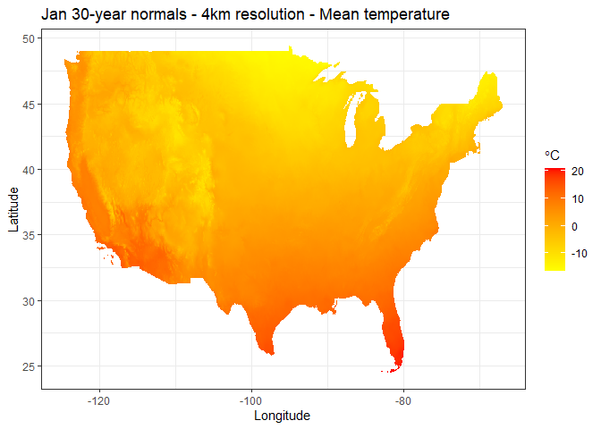
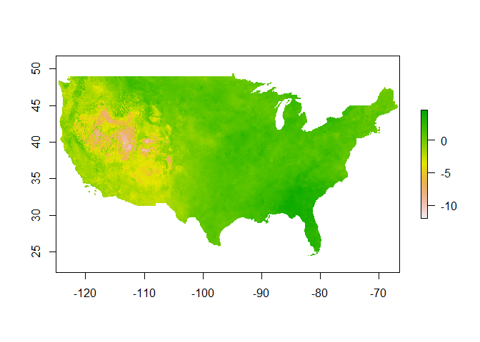
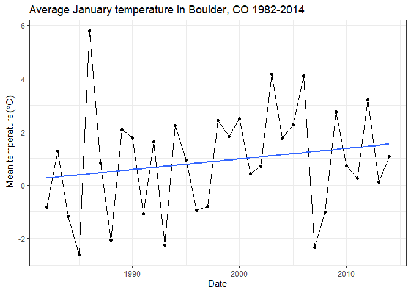
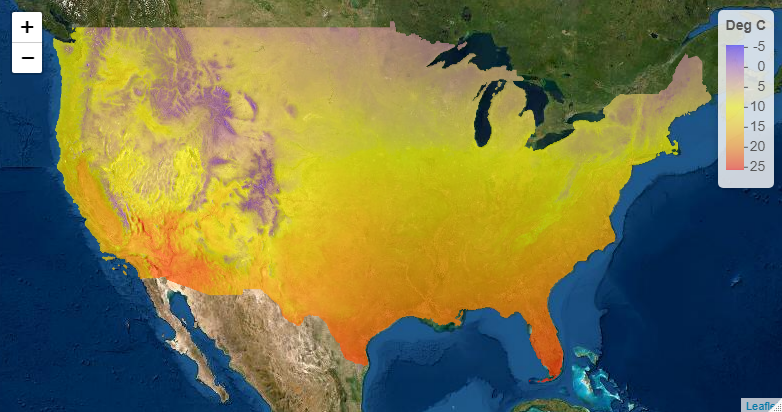

<!-- README.md is generated from README.Rmd. Please edit that file -->

# `prism`

[](https://cran.r-project.org/package=prism)
[](https://travis-ci.org/ropensci/prism)
[](https://ci.appveyor.com/project/sckott/prism/branch/master)
[](https://codecov.io/github/ropensci/prism?branch=master)

This package allows users to access and visualize data from the [Oregon
State PRISM project](http://www.prism.oregonstate.edu/). Data are all in
the form of gridded rasters for the continental US at 4 different
temporal scales: daily, monthly, annual, and 30 year normals. Please see
their webpage for a full description of the data products, or [see their
overview](http://www.prism.oregonstate.edu/documents/PRISM_datasets_aug2013.pdf).

## Installation

prism is available on CRAN:

``` r
install.packages("prism")
```

Or the development version can be installed from GitHub with devtools:

``` r
# install.packages("devtools")
library(devtools)
install_github(repo = "prism", username = "ropensci")
```

## Quickstart

The overall work flow in the prism package is (links go to details on
this page):

1.  [Set the download directory](#downloading-data), i.e., the folder on
    your computer that prism data will be saved to:
    `prism_set_dl_dir()`. This is now referred to as the “prism
    archive”.
2.  [Download prism data to the archive:](#download-30-year-normal-data)
    `get_prism_*()`. Each folder, or variable, timestep, day/month/year
    is stored in a single folder in the archive and referred to as prism
    data (`pd`).
3.  [Interact with the prism
    archive:](#interact-with-the-archive-and-prism-data)
    `prism_archive_*()`. Or interact with the prism data: `pd_*()`.

The remainder of this README provides examples following this work flow.

## prism data and parameters

Data are available in 4 different temporal scales as mentioned above. At
each temporal scale, there are 7 different parameters/variables
available. Keep in mind these are modeled parameters, not measured.
Please see the [full
description](http://www.prism.oregonstate.edu/documents/Daly2008_PhysiographicMapping_IntJnlClim.pdf)
for how they are calculated.

| Parameter name | Description                          |
| :------------- | :----------------------------------- |
| *tmean*        | Mean temperature                     |
| *tmax*         | Maximum temperature                  |
| *tmin*         | Minimum temperature                  |
| *tdmean*       | Mean dew point temperature           |
| *ppt*          | Total precipitation (rain and snow)  |
| *vpdmin*       | Daily minimum vapor pressure deficit |
| *vpdmax*       | Daily maximum vapor pressure deficit |

## Downloading data

Before downloading any data, set the directory that the prism data will
be saved to:

``` r
library(prism)
#> Be sure to set the download folder using `prism_set_dl_dir()`.
prism_set_dl_dir("~/prismtmp")
```

This is now referred to as the “prism archive”. The `prism_archive_*()`
functions allow the user to search through the archive. The prism
archive contains “prism data”. The prism data are referred to by their
folder names, even though the “real” data are the .bil, .txt, and other
files that exist in the folder. The prism data (`pd`) can be accessed
using the `pd_*()` functions.

### Download 30-year normal data

Normals are based on the latest 30-year period; currently 1981 - 2010.
Normals can be downloaded in two resolutions, 4km and 800m, and a
resolution must be specified. They can be downloaded for a given month,
vector of months, or annual averages for all 30 years.

``` r
# Download the January - June 30-year averages at 4km resolution
get_prism_normals(type="tmean", resolution = "4km", mon = 1:6, keepZip = FALSE)

# Download the 30-year annual average precip and annual average teperature
get_prism_normals("ppt", "4km", annual = TRUE, keepZip = FALSE)
get_prism_normals("tmean", "4km", annual = TRUE, keepZip = FALSE)
```

If the archive has not already been set, calling any of the
`get_prism_*()` functions will prompt the user to specify the directory.
prism data are downloaded as zip files and then unzipped. If the
`keepZip` argument is `TRUE` the zip file will remain on your machine,
otherwise it will be automatically deleted.

### Download daily, monthly, and annual data

Let us download daily average temperatures from June 1 to June 14, 2013.
We can also download January average temperature data from 1982 to 2014.
Finally, we will download annual average precipitation for 2000 to 2015.

``` r
get_prism_dailys(
  type = "tmean", 
  minDate = "2013-06-01", 
  maxDate = "2013-06-14", 
  keepZip = FALSE
)
get_prism_monthlys(type = "tmean", year = 1982:2014, mon = 1, keepZip = FALSE)
get_prism_annual("ppt", years = 2000:2015, keepZip = FALSE)
```

Note that for daily data you need to give a well formed date string in
the form of “YYYY-MM-DD”.

## Interact with the archive and prism data

You can view all the prism data you have downloaded with a simple
command: `prism_archive_ls()`. This function gives a list of folder
names, i.e., prism data (`pd`). All the functions in the prism package
work off of one or more of these folder names (`pd`).

``` r
## Truncated to keep file list short
prism_archive_ls()
#>  [1] "PRISM_ppt_30yr_normal_4kmM2_annual_bil"  
#>  [2] "PRISM_ppt_30yr_normal_800mM2_02_bil"     
#>  [3] "PRISM_ppt_stable_4kmD2_20120101_bil"     
#>  [4] "PRISM_ppt_stable_4kmM3_2000_bil"         
#>  [5] "PRISM_ppt_stable_4kmM3_2001_bil"         
#>  [6] "PRISM_ppt_stable_4kmM3_2002_bil"         
#>  [7] "PRISM_ppt_stable_4kmM3_2003_bil"         
#>  [8] "PRISM_ppt_stable_4kmM3_2004_bil"         
#>  [9] "PRISM_ppt_stable_4kmM3_2005_bil"         
#> [10] "PRISM_ppt_stable_4kmM3_2006_bil"         
....
```

While prism functions use this folder format, other files may need an
absolute path (e.g. the `raster` package). The `pd_to_file()` function
conveniently returns the absolute path. Alternatively, you may want to
see what the normal name for the product is (not the file name), and we
can get that with the `pd_get_name()` function.

``` r
## Truncated to keep file list short
pd_to_file(prism_archive_ls())
#>  [1] "C:\\Users\\RAButler\\Documents\\prismtmp\\PRISM_ppt_30yr_normal_4kmM2_annual_bil\\PRISM_ppt_30yr_normal_4kmM2_annual_bil.bil"    
#>  [2] "C:\\Users\\RAButler\\Documents\\prismtmp\\PRISM_ppt_30yr_normal_800mM2_02_bil\\PRISM_ppt_30yr_normal_800mM2_02_bil.bil"          
#>  [3] "C:\\Users\\RAButler\\Documents\\prismtmp\\PRISM_ppt_stable_4kmD2_20120101_bil\\PRISM_ppt_stable_4kmD2_20120101_bil.bil"          
#>  [4] "C:\\Users\\RAButler\\Documents\\prismtmp\\PRISM_ppt_stable_4kmM3_2000_bil\\PRISM_ppt_stable_4kmM3_2000_bil.bil"                  
#>  [5] "C:\\Users\\RAButler\\Documents\\prismtmp\\PRISM_ppt_stable_4kmM3_2001_bil\\PRISM_ppt_stable_4kmM3_2001_bil.bil"                  
....

pd_get_name(prism_archive_ls())
#>  [1] "Annual 30-year normals - 4km resolution - Precipitation"      
#>  [2] "Feb 30-year normals - 800m resolution - Precipitation"        
#>  [3] "Jan 01 2012 - 4km resolution - Precipitation"                 
#>  [4] "2000 - 4km resolution - Precipitation"                        
#>  [5] "2001 - 4km resolution - Precipitation"                        
....
```

Finally, `prism_archive_subset()` is a convenient way to search for
specific parameters, time steps, days, months, years, or ranges of days,
months, years.

``` r
# we know we have downloaded June 2013 daily data, so lets search for those 
prism_archive_subset("tmean", "daily", mon = 6)
#>  [1] "PRISM_tmean_stable_4kmD2_20130601_bil"
#>  [2] "PRISM_tmean_stable_4kmD2_20130602_bil"
#>  [3] "PRISM_tmean_stable_4kmD2_20130603_bil"
#>  [4] "PRISM_tmean_stable_4kmD2_20130604_bil"
#>  [5] "PRISM_tmean_stable_4kmD2_20130605_bil"
#>  [6] "PRISM_tmean_stable_4kmD2_20130606_bil"
#>  [7] "PRISM_tmean_stable_4kmD2_20130607_bil"
#>  [8] "PRISM_tmean_stable_4kmD2_20130608_bil"
#>  [9] "PRISM_tmean_stable_4kmD2_20130609_bil"
#> [10] "PRISM_tmean_stable_4kmD2_20130610_bil"
#> [11] "PRISM_tmean_stable_4kmD2_20130611_bil"
#> [12] "PRISM_tmean_stable_4kmD2_20130612_bil"
#> [13] "PRISM_tmean_stable_4kmD2_20130613_bil"
#> [14] "PRISM_tmean_stable_4kmD2_20130614_bil"

# or we can loook for days between June 7 and June 10
prism_archive_subset(
  "tmean", "daily", minDate = "2013-06-07", maxDate = "2013-06-10"
)
#> [1] "PRISM_tmean_stable_4kmD2_20130607_bil"
#> [2] "PRISM_tmean_stable_4kmD2_20130608_bil"
#> [3] "PRISM_tmean_stable_4kmD2_20130609_bil"
#> [4] "PRISM_tmean_stable_4kmD2_20130610_bil"
```

### Raster plots

You can easily make a quick plot of your data using the output of
`prism_archive_ls()` or `prism_archive_subset()` with `pd_image()`.

``` r
# Plot the January 30-year average temperatures
jmean <- prism_archive_subset(
  "tmean", "monthly normals", mon = 1, resolution = "4km"
)
pd_image(jmean)
```

<!-- -->

It is easy to load the prism data with the raster package. This time we
will look at January temperature anomalies. To do this we will examine
the difference between January 2013 and the January 30-year normals.
Conveniently, we already downloaded these data. We just need to grab
them out of our archive.

``` r
library(raster)
#> Loading required package: sp
# knowing the name of the files you are after allows you to find them in the 
# list of all files that exist
# jnorm_name <- "PRISM_tmean_30yr_normal_4kmM2_01_bil"
# j2013_name <- "PRISM_tmean_stable_4kmM3_201301_bil"
# but we will use prism_archive_subset() to find the files we need

jnorm <- prism_archive_subset(
  "tmean", "monthly normals", mon = 1, resolution = "4km"
)
j2013 <- prism_archive_subset("tmean", "monthly", years = 2013, mon = 1)

# raster needs a full path, not the "short" prism data name
jnorm <- pd_to_file(jnorm)
j2013 <- pd_to_file(j2013)

## Now we'll load the rasters.
jnorm_rast <- raster(jnorm)
j2013_rast <- raster(j2013)

# Now we can do simple subtraction to get the anomaly by subtracting 2014 
# from the 30 year normal map
anomCalc <- function(x, y) {
  return(x - y)
}

anom_rast <- raster::overlay(j2013_rast,jnorm_rast,fun = anomCalc)

plot(anom_rast)
```

<!-- -->

The plot shows that January 2013 was warmer than the average over the
last 30 years. It also shows how easy it is to use the raster library to
work with prism data. The package provides a simple framework to work
with a large number of rasters that you can easily download and
visualize or use with other data sets.

### Single grid cell plot

You can also visualize a single point across multiple prism data files
(slice) using `pd_plot_slice()`. This procedure will take a set of
rasters, create a “`raster::stack`”, extract data at a point, and then
create a ggplot2 object.

Let’s now make a plot of January temperatures in Boulder between 1982
and 2014. First we’ll grab all the data from the US (downloaded in the
previous step), and then give our function a point to get data from. The
point must be a vector in the form of longitude, latitude. Because
`pd_plot_slice()` returns a gg object, it can be combined with other
ggplot functions.

``` r
library(ggplot2)
# data already exist in the prism dl dir
boulder <- c(-105.2797, 40.0176)

# prism_archive_subset() will return prism data that matches the specified 
# variable, time step, years, months, days, etc.
to_slice <- prism_archive_subset("tmean", "monthly", mon = 1)
p <- pd_plot_slice(to_slice, boulder)

# add a linear average and title
p + 
  stat_smooth(method="lm", se = FALSE) + 
  theme_bw() + 
  ggtitle("Average January temperature in Boulder, CO 1982-2014")
#> `geom_smooth()` using formula 'y ~ x'
```

<!-- -->

### leaflet map

Finally, the prism data are in a form that can be used with leaflet maps
(with the help of the raster package). The [leaflet
package](https://cran.r-project.org/web/packages/leaflet/) allows you to
easily make javascript maps using the [leaflet](http://leafletjs.com/)
mapping framework using prism data. These can easily be hosted on
websites like [Rpubs](https://rpubs.com/) or your own site. Here is a
simple example of plotting the [30-year normal for annual
temperature](https://rpubs.com/DistribEcology/122453). If you run this
code you will have an interactive map, instead of just the screen shot
shown here.

``` r
library(leaflet)
library(raster)
library(prism)

# 30-year normal average temperature have already been downloaded for 
norm <- prism_archive_subset(
  "tmean", "annual normals", resolution = "4km"
)
rast <- raster(pd_to_file(norm))

# Create color palette and plot
pal <- colorNumeric(
  c("#0000FF", "#FFFF00", "#FF0000"), 
  values(rast),
  na.color = "transparent"
)

leaflet() %>% 
  addTiles(
    urlTemplate = 'http://server.arcgisonline.com/ArcGIS/rest/services/World_Imagery/MapServer/tile/{z}/{y}/{x}'
  ) %>% 
  addRasterImage(rast, colors = pal, opacity=.65) %>% 
  addLegend(pal = pal, values = values(rast), title = "Deg C")
```

\[
